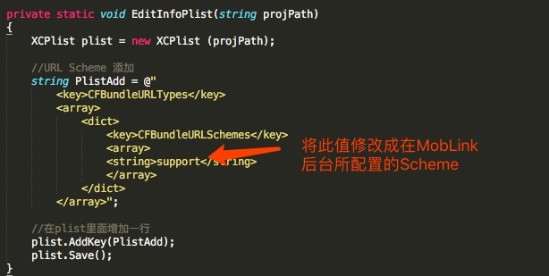
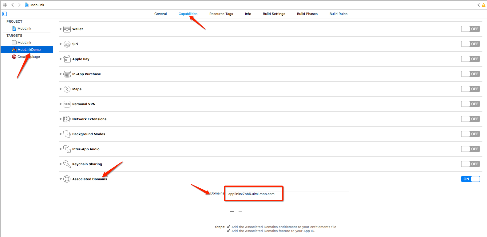

# Unity For MobLink 快速集成文档

## 下载并导入MobLink

下载[Unity-For-MobLink](https://github.com/MobClub/Unity-For-MobLink),打开项目双击MobLink.unitypackage相关文件。注意该操作可能会覆盖您原来已经存在的文件！ 


## 拖入MobLink并配置MobLink AppKey

导入unitypackage后,在Plugins - MobLink 中找到MobLink.prefab。将其拖载到您的项目中,如图示


## 调用接口及获取回调

### 调用获取mobid

```
Hashtable custom = new Hashtable ();
custom ["ChapterID"] = 1001;
custom ["ChapterName"] = "Dragon Fire";
//构造场景参数
MobLinkScene scene = new MobLinkScene ("/chapter1/dragon", "userid-123456", custom);
//获取mobid
MobLink.getMobId (scene);
```


### 设置回调

```
//获取mobid之回调
void mobIdHandler (string mobid)
{
	Console.Write ("Received MobId:" + mobid);
}
		
//场景恢复之回调(在应用唤醒时此回调会被触发)
void sceneHandler (MobLinkScene scene)
{
	Console.Write ("path:" + scene.path);
	Console.Write ("source:" + scene.source);
	Console.Write ("params:" + MiniJSON.jsonEncode (scene.customParams));
}
```

```
MobLink.onGetMobId += mobIdHandler;
MobLink.onRestoreScene += sceneHandler;
```


### 对于Android端的一些配置

### 对于iOS端的一些配置

预配置Scheme:
找到MobLinkAutoPackage - Editor - SDKPorter - MobLinkPostProcessBuild.cs
在EditInfoPlist方法中，修改CFBundleURLSchemes 下的值,将其设置为您在MobLink后台填入的 URI Scheme (注意不带'://')




配置Universal Link:
在生成Xcode项目后,配置在MobLink后台所填入的Universal Link



